# Amazon ECS Lab

This lab is designed to take you from scratch and finished with a deployed application.  So, what are we going to do?

1. [Create a Docker image repository using ECR (EC2 Container Registry)](#creating-ecr-repo)
2. [Push an image to ECR](#push-an-image-to-ecr)
3. [Create an ALB (Application Load Balancer)](#creating-an-application-load-balancer)
4. [Define an ECS Cluster](#define-an-ecs-cluster)
5. [Define the ecsInstanceRole (if needed)](#define-the-ecsinstancerole)
6. [Create an Auto Scaling Group that will auto-enroll in our ECS Cluster](#create-an-auto-enrolling-auto-scaling-group)
7. [Create a Task Definition to run our application](#create-a-task-definition)
8. [Define a service to run our task](#define-a-service-to-run-the-task)
9. [Check out the app in all of its gloriousness!](#check-out-the-app)
10. [Roll out an update](#roll-out-an-update)
11. [Tear it all down](#tear-it-all-down)


_Note: All screenshots are of the AWS console as of January 10, 2017. It's a continuously evolving product, so there may be differences in what you see._


## Setup
- This lab DOES require an AWS account. However, all resources fall within the free tier, so creating a new account and doing this lab should cost you nothing!
- You will obviously need Docker installed
- We will be using two images from Docker Hub (`mikesir87/cats:1.0` and `mikesir87/cats:1.1`). Feel free to pull them beforehand.


## Creating ECR Repo

1. Log in to the AWS console
2. In the Services view, select **EC2 Container Service**.
   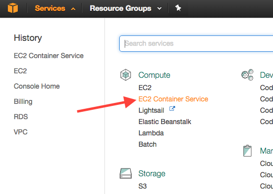
3. Click the **Repositories** link in the left navigation menu.
   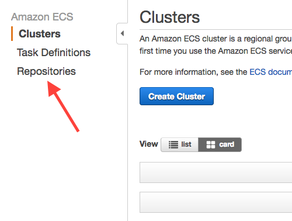
4. Click the **Get Started** button (only appears if you haven't made any repositories yet)
   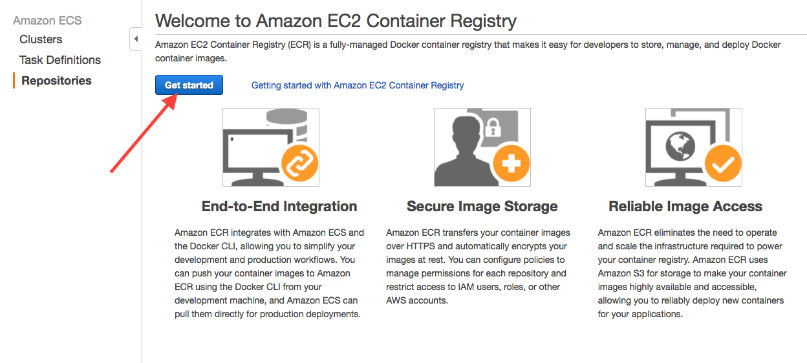
5. Insert a **Repository name** for the new repo.  For our example, we're going to use the name _cats_.
   

That's it!  The final page has some important information, such as the full URL (`1234567890.dkr.ecr.us-east-1.amazonaws.com/cats` for me) of the repository and how to push to it.  We'll do that now!


## Push an image to ECR

Now that we have a repository, let's push something into it.  This would normally be a step in a CI/CD pipeline.  But, for the lab, we're going to take an existing image and re-tag it and push it into our new repo.

1. Pull (if you haven't yet) the `mikesir87/cats:1.0` image

    ```docker pull mikesir87/cats:1.0```
2. Tag the image. Use the last page for an example.  Just tweak the starting image in the command...

   ```docker tag mikesir87/cats:1.0 1234567890.dkr.ecr.us-east-1.amazonaws.com/cats:1.0```

3. If you try to push now, you'll most likely get a `no basic auth credentials` error.  We need to configure our Docker client with credentials.  We'll quickly setup a new user with an access key to use for the lab.

   1. Go to the `IAM` service in the AWS console.
   2. Click the **Add User** button.
   3. Enter a username of `cat-demo` and select the `Programmatic access` option for **Access Type**
      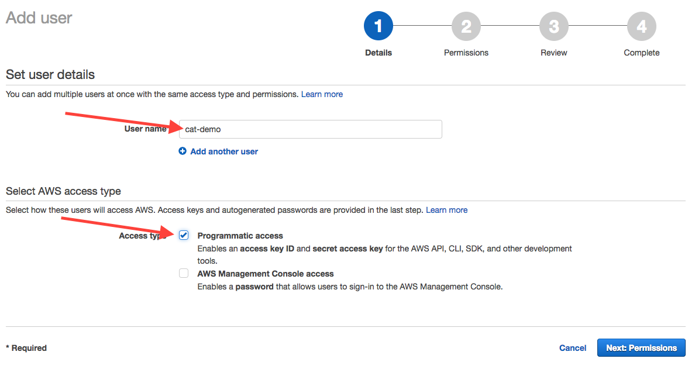
   4. For permissions, select the **Attach existing policies directly** and choose the **AdministratorAccess** policy.  Note that this grants access to everything, so you'll want to remove this user once we're done.
      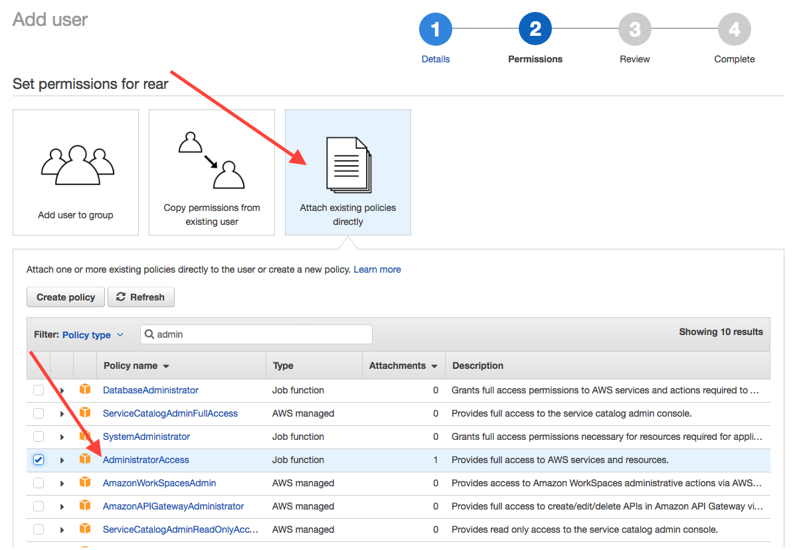
   5. Copy the **Access key ID** and **Secret access key** and create a file named `credentials` that looks like this...
      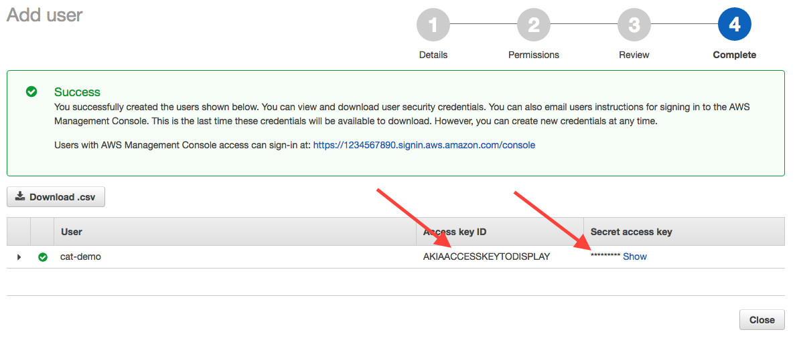

    ```
    [default]
    aws_access_key_id=THE_AWS_ACCESS_KEY
    aws_secret_access_key=THE_AWS_SECRET_ACCESS_KEY
    ```

   6. Run the following Docker command to get a subsequent Docker login command:
    
    ```
    docker run --rm -v $(pwd)/credentials:/root/.aws/credentials mikesir87/aws-cli aws --region=us-east-1 ecr get-login
    ```

   7. Copy the output from the previous command (should be `docker login -u AWS -p ......`) and run the command. If successful, you should get a `Login Succeeded` message.

4. Now... let's push our image!

   ```docker push 1234567890.dkr.ecr.us-east-1.amazonaws.com/cats:1.0```

If we go back into the ECR repository, we should now see the image we just pushed!  Hooray!

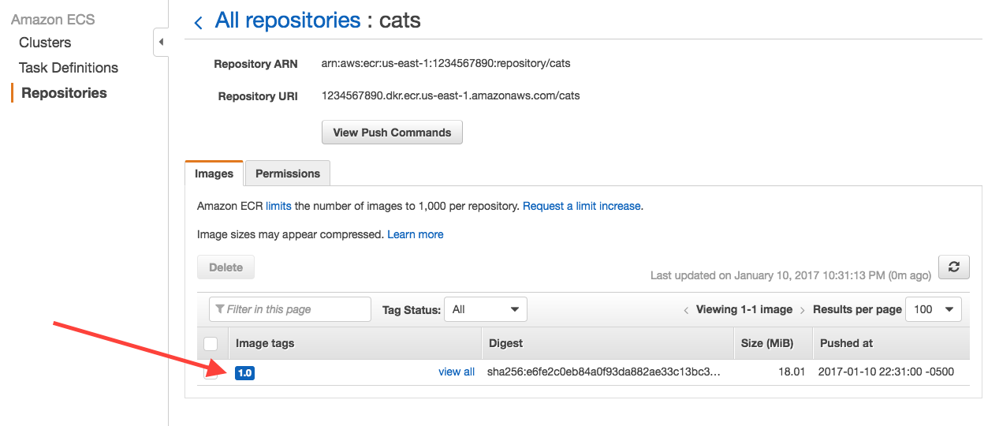


## Creating an Application Load Balancer

The load balancer will be used to receive traffic and pass it on to a container running the application.  We don't _have_ to do this quite yet, but it has to be done before we define the ECS service.  So, might as well do it before we dive into all of the ECS setup.

1. In the Services menu, go to **EC2**.
    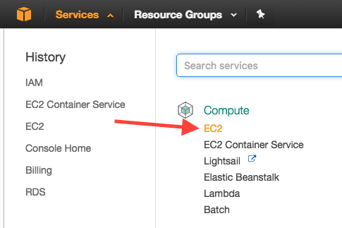
2. Click the **Load Balancers** link in the left navigation menu.
    
3. Click the **Create Load Balancer** button.
4. Select the **Application Load Balancer** option.
    
5. For the LB configuration...
     - **Name**: _alb-cats_
     - **Listeners**: HTTP Port 80 (there by default)
     - **VPC**: The one labeled as `default`
     - **Subnets**: Subnets in Availability Zones `a` and `b`
    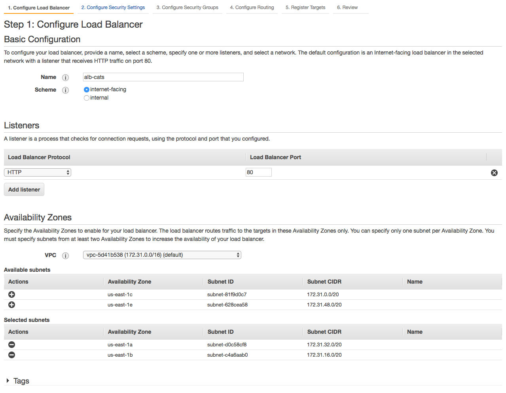
6. Skip through **Security Settings** (we're not using HTTPS, so don't need to configure certificates)
7. For Security Group configuration, we're going to make a policy that accepts HTTP traffic from all sources...
    - **Security group name:** secgroup-http-all
    - **Rule**: HTTP | TCP | Port 80 | Custom 0.0.0.0/0
    
8. For Target Group setup, we're going to create a new Target Group that will send all traffic to the `/` path to our container, which will be exposing its container port 5000.
    - **Name**: tg-cats
    - **Protocol**: HTTP
    - **Port**: 5000 (this is the container's port, not the mapped host port)
    
9. Click through the rest of the steps to finish the setup.


## Define an ECS Cluster

1. Go back into the ECS service using the Services menu.
2. Click the **Clusters** link in the left navigation menu.
   
3. Click the **Create Cluster** button.
4. Setup the ECS Cluster using the following configuration...
   - **Cluster name**: cats-cluster
   - Check the **Create an empty cluster**. We're going to populate the cluster using an Auto Scaling Group
   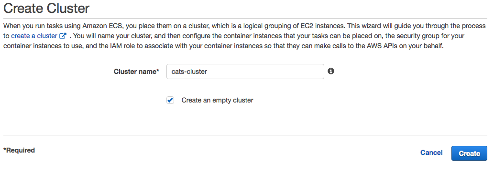

You'll land on the cluster's page. Obviously, we don't have any registered instances.  But... that'll change shortly!


## Define the ecsInstanceRole

The `ecsInstanceRole` is required in order for an EC2 instance to register itself with the cluster, pull images from the repository, and push logs into CloudWatch.  It's quite possible this role was created for you during the "ECS Getting Started" walkthrough.

Rather than re-hashing out the steps, the AWS documentation has a great write-up on this.  [Follow the link here](http://docs.aws.amazon.com/AmazonECS/latest/developerguide/instance_IAM_role.html)


## Create an auto-enrolling Auto Scaling Group

In this step, we are going to do two things... 1) create a launch configuration that defines an AMI and startup configuration and then 2) an auto-scaling policy that actually launches the resources.

1. Go to the **EC2** service using the Services menu.
2. Click the **Launch Configurations** link in the left navigation menu.
   .
3. Click the **Create Auto Scaling group** button.
4. For AMI selection, click the **Community AMIs** link and search for the ECS optimized AMI.  You can get the current AMI ID here - [ECS Optimized AMI docs](http://docs.aws.amazon.com/AmazonECS/latest/developerguide/ecs-optimized_AMI.html).  As of the time of writing, it's `ami-a58760b3` for the `us-east-1` region. _Be sure to verify the AMI id_ before hitting the Select button. I've had searches for a specific ID return multiple results (not sure why).
   
5. For instance type, go ahead and just select the `t2.micro` instance to keep on the free tier.
6. On the Launch Configuration...
   - **Name**: lc-cats
   - **IAM role**: ecsInstanceRole
   - **User data** (under Advanced Details): paste the following...
   ```
   #!/bin/bash
   echo ECS_CLUSTER=cats-cluster >> /etc/ecs/ecs.config
   ```
   
7. Go ahead and click through the Storage options with no changes.
8. For the security group config, we want to setup our instance to accept traffic from only our ALB heading to our Docker containers.
   - **Security group name**: secgroup-alb-to-docker
   - **Rule**: Custom TCP Rule | TCP | 32768-65535 | Custom IP | type in `secgroup-http-all` and select the security group
   - It's up to you whether you allow SSH access. I personally like locking myself out of my machines, so I'm leaving it off. Feel free to add it if you want.
9. Click through to complete the launch configuration.

Now... it's time to create the auto scaling group!

1. Setup the group details...
   - **Group name**: asg-cats
   - **Group size**: 2 instances
   - **Network**: Choose the VPC with _(default)_ in it
   - **Subnet**: Pick the subnets in the `a` and `b` Availability Zones
   
2. Click through the policies and notifications screens.
3. For the Tags, we'll add a tag so the created instances have a name in the dashboard
   - **Name**: Name
   - **Value**: cats
   
4. Click through to finish up the setup.

In a few moments, you should have two instances created, visible in both the EC2 dashboard...


... and in the cluster's dashboard.


## Create a Task Definition

The task definition defines what we want to do and its constraints. We define the image, the CPU/RAM limits, volumes, ports, etc.

1. Go to the ECS Service using the Services menu (if not there already).
2. Click the **Task Definitions** link in the left navigation menu.
3. Click the **Create Task Definition** button.
4. For the configuration, enter the following...
   - **Task Definition Name**: cat-app-task
   - Click the **Add container** button and provide the following configuration:
     - **Container name**: cat-app
     - **Image**: the full repo URL (`1234567890.dkr.ecr.us-east-1.amazonaws.com/cats:1.0`)
     - **Memory Limits**: set a Hard limit of 256MB
     - **Port mappings**: container port of 5000 (leave host port empty)
     
5. Submit to create the task!


## Define a service to run the task

The service will do a few things for us... ensure we have the desired number of containers running and automatically update the load balancer.

1. Go to the ECS service using the Services menu (if not there already).
2. Click on the **Clusters** link in the left navigation menu.
3. Click on the **cats-cluster** cluster.
4. In the **Services** tab, click the **Create** button.
   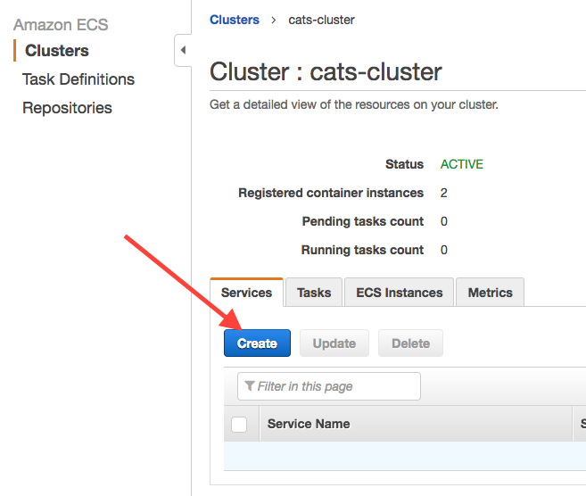
5. For the service configuration, enter the following...
   - **Task Defintion**: select the **cat-app-task** task we just created
   - **Cluster**: cats-cluster
   - **Service name**: cat-app-service
   - **Number of tasks**: 2 (we want to run two instances of the app at all times)
   - **Minimum healthy percent**: 50 (allows ECS to drop to one instance as needed... like during an update rollout)
   - **Maximum percent**: 200 (just leave the default)
   - **Placement Templates**: go ahead and leave it on **AZ Balanced Spread**, which ensures that tasks are distributed across Availability Zones
   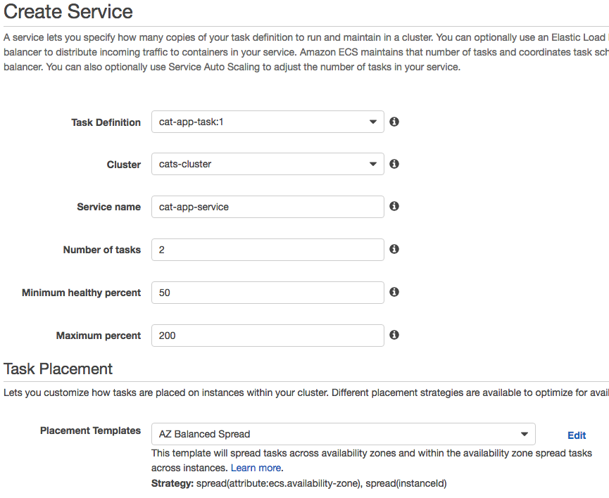
6. Click the **Configure ELB** button and configure the following...
   - Select the **Application Load Balancer**
   - **ELB Name**: alb-cats
   - In **Select a Container**, select the _cat-app:0:5000_ container and click the **Add to ELB** button
   - Jump down to the **Target group name** field and change **create new** to **tg-cats**
   - Save the configuration
7. Create the service!

After a few seconds, the service will be created and configured. You should be able to go back to the service and eventually see tasks running on it!

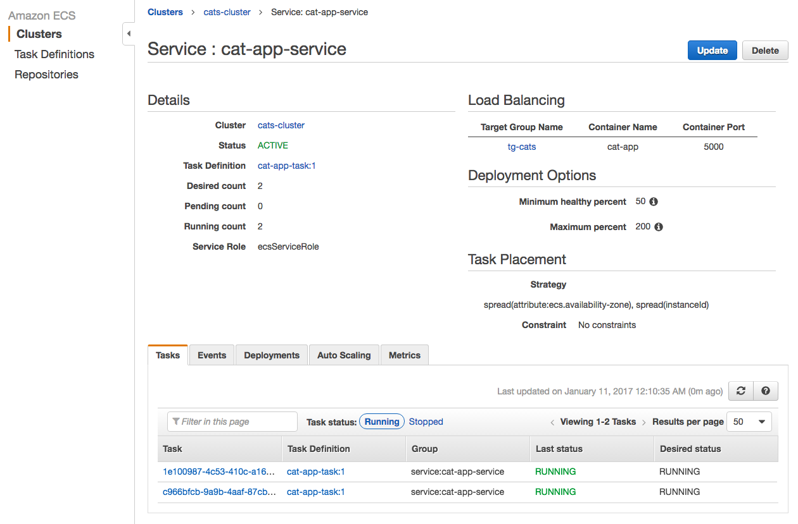


## Check out the app!

So... we're basically done!  Just need to check it out!  Go back to the load balancer's configuration screen (in the EC2 service) and get the **DNS name**.

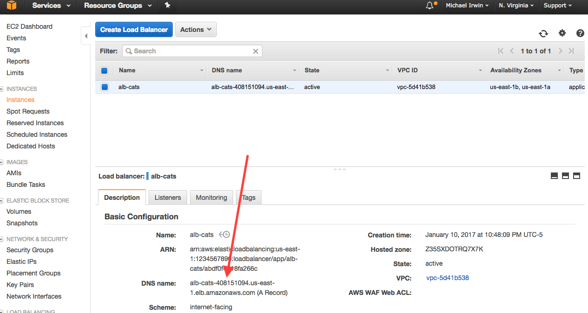

Then... open that up in the browser!

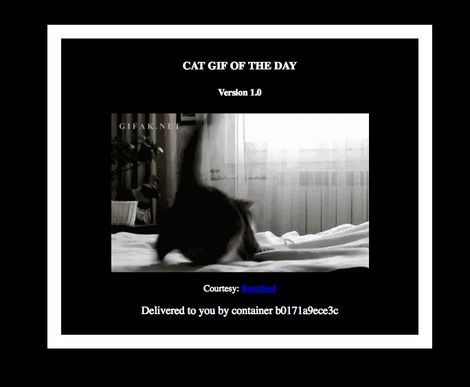

If you refresh a few times, you should get different container IDs, as we're running two instances of the app and the load balancer is distributing traffic between both containers.  Cool, huh?

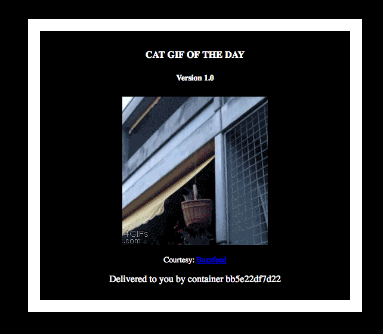


## Roll out an update

First, let's push an update to our image...

```
docker pull mikesir87/cats:1.1
docker tag mikesir87/cats:1.1 1234567890.dkr.ecr.us-east-1.amazonaws.com/cats:1.1
docker push 1234567890.dkr.ecr.us-east-1.amazonaws.com/cats:1.1
```

Now, we need to make a new revision of the Task Definition.

1. Go to the ECS service using the Services menu (if not already there).
2. Select the **Task Definitions** link from the left navigation menu.
3. Click the **cat-app-task** task definition.
4. Click the checkbox next to the latest revision (should only be one) and click the **Create new revision** button.
   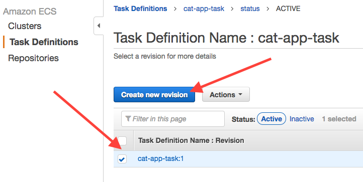
5. Click the **cat-app** container we had previously configured.
6. Update the image to use tag `1.1`, instead of `1.0`.
7. Create the revision.


At this point, we only need to update our service to use the new revision.

1. While still on the task definition page, hit the **Actions** button and click the **Update service** link.
   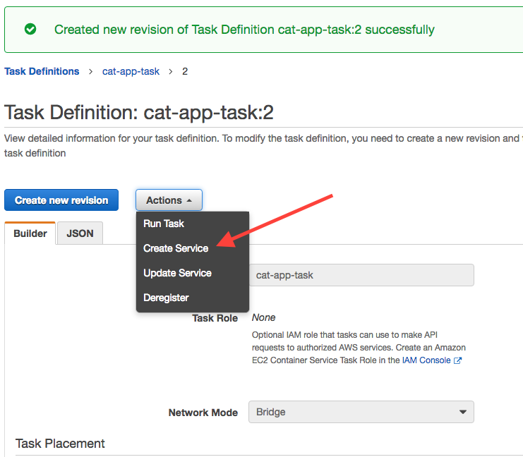
2. Make sure the **cat-app-service** is selected and hit **Update Service**.

So... what's going to happen?

- A task is chosen to be removed. It's first deregistered from the load balancer.
- The task is ordered to be stopped.
- A new task is started, using the definition.
- The task is re-enrolled with the load balancer.
- The next task is then deregistered and updated.

There may be a short time that refreshing the browser will give you both the updated and old app. That's to be expected.  But eventually...


## Tear it all down

To clean up, do the following...

- Go into the `cat-app-service` service configuration and update the **Number of tasks** to 0.  Then, you can delete the service.
- Delete the cluster.
- You can't (for whatever reason) delete a task, but you can "Deregister" each revision. Once all revisions are deregistered, the task disappears (or is deleted??).  So, deregister the definitions.
- Go to the Auto Scaling group and update the Desired and Min counts to 0.
- Delete both the Auto Scaling group and Launch Configuration.
- Delete the load balancer and target group
- Delete the security groups (`secgroup-alb-to-docker` and then `secgroup-http-all`).
- Delete the IAM user we created


## Conclusion

So, what did we do?  We created a repo and pushed images into it, configured a load balancer, created an auto scaling group that auto-enrolled created instances into an ECS cluster, and deployed containerized apps. We even did a rolling update!  Not too bad, eh?

If you find anything that needs to be updated/tweaked, feel free to send a pull request!